# Ciberseguridad_2026_Laboratorio_Parte2

Instituto Profesional Santo Tomás Iquique

**Nombre:** Martín Obregón Díaz  
**Carrera:** Ingeniería en Informática  
**Asignatura:** Ciberseguridad  

---

# Descripción

En este repositorio se documentan los laboratorios prácticos desarrollados en la segunda parte de la asignatura de Ciberseguridad, utilizando máquinas virtuales con Kali Linux y Ubuntu Server para simular escenarios de defensa activa y detección de ataques.

Durante las actividades se trabajó con herramientas de análisis de vulnerabilidades, aplicación de parches de seguridad, automatización de actualizaciones y sistemas IDS/IPS como Fail2Ban para detectar y bloquear ataques en tiempo real.

---

# Entorno de Trabajo

- Kali Linux
- Ubuntu Server
- Nmap
- Fail2Ban
- Hydra
- OpenSSH
- Apache2
- ProFTPD
- unattended-upgrades
- iptables

---

# Lab 1 - Práctica de Defensa Activa

## Objetivo

Identificar vulnerabilidades presentes en servicios expuestos, investigar su impacto, priorizar riesgos y aplicar medidas de mitigación mediante actualización y automatización de parches de seguridad.

---

## Escaneo de vulnerabilidades

Desde Kali Linux se realizó un escaneo utilizando Nmap para identificar servicios vulnerables y sus respectivos CVE.

```bash
sudo nmap -sV --script vuln --script-args=unsafe=1 -p- IP_Ubuntu
```

Este comando permitió detectar versiones vulnerables de distintos servicios y ejecutar scripts de análisis más agresivos.

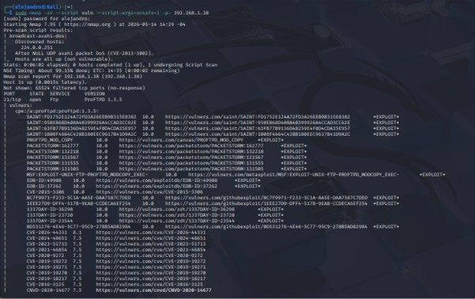

---

## Investigación y priorización de vulnerabilidades

Luego del escaneo se investigaron las vulnerabilidades encontradas y se clasificaron según su nivel de criticidad.

Las vulnerabilidades más críticas identificadas fueron:

- OpenSSH CVE-2023-38408
- Apache HTTP Server CVE-2026-28780
- ProFTPD CVE-2016-3125

Posteriormente se aplicó una política de priorización para actualizar primero los servicios más críticos.

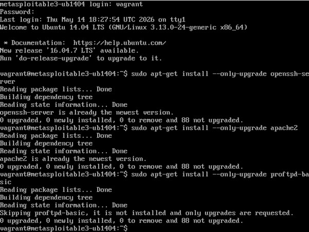

---

## Instalación de unattended-upgrades

Con el objetivo de automatizar las actualizaciones de seguridad se instaló el paquete unattended-upgrades.

```bash
sudo apt install unattended-upgrades
```

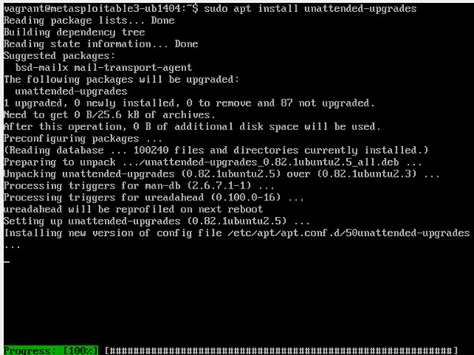

---

## Configuración de actualizaciones automáticas

Posteriormente se configuró el archivo:

```bash
/etc/apt/apt.conf.d/50unattended-upgrades
```

Para permitir únicamente la instalación automática de actualizaciones de seguridad.

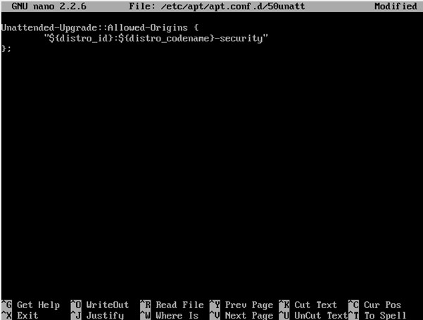

---

## Configuración de auto-upgrades

Luego se editó el archivo:

```bash
/etc/apt/apt.conf.d/20auto-upgrades
```

Agregando la siguiente configuración:

```bash
APT::Periodic::Update-Package-Lists "1";
APT::Periodic::Unattended-Upgrade "1";
```

Con esto el sistema quedó configurado para verificar e instalar actualizaciones automáticamente una vez al día.

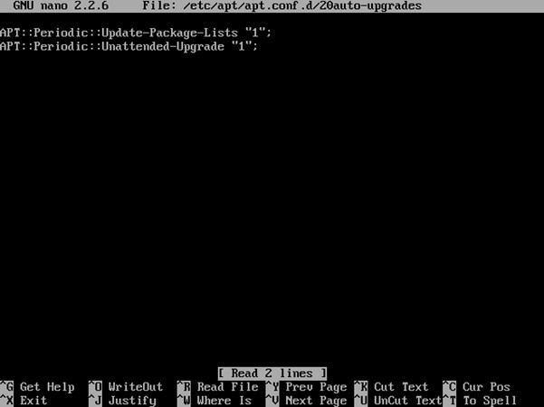

---

## Verificación de configuración

Finalmente se verificó el funcionamiento de unattended-upgrades utilizando el siguiente comando:

```bash
sudo unattended-upgrade --dry-run
```

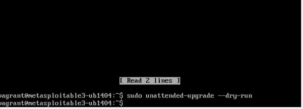

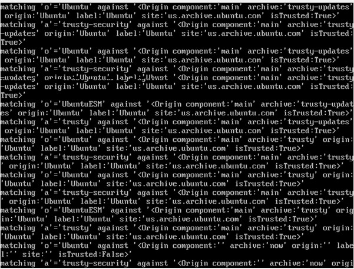

---

# Lab 2 - Implementación IDS con Fail2Ban

## Objetivo

Implementar un sistema de detección y bloqueo automático de ataques de fuerza bruta utilizando Fail2Ban sobre el servicio SSH.

---

## Instalación de Fail2Ban

En Ubuntu Server se instaló Fail2Ban utilizando el siguiente comando:

```bash
sudo apt install fail2ban
```

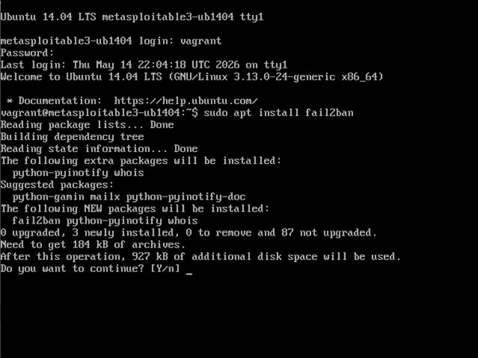

---

## Configuración de jail.local

Posteriormente se creó el archivo de configuración:

```bash
sudo nano /etc/fail2ban/jail.local
```

Configurando la protección para SSH.

```bash
[sshd]
enabled = true
port = ssh
filter = sshd
logpath = /var/log/auth.log
maxretry = 3
bantime = 600
findtime = 300
```

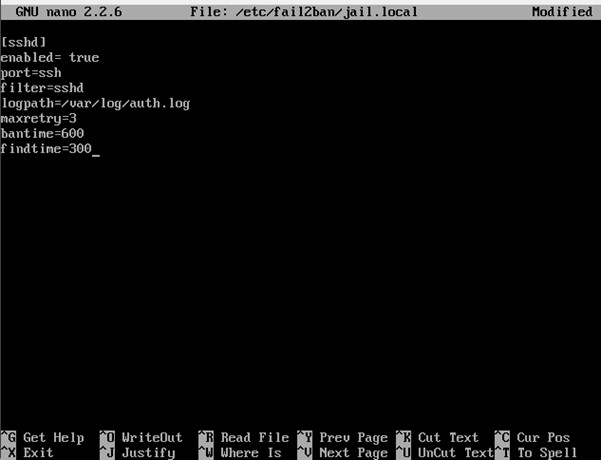

---

## Inicio y verificación del servicio

Luego se inició y reinició el servicio Fail2Ban para aplicar la configuración.

```bash
sudo service fail2ban start
sudo service fail2ban restart
```

También se verificó el estado del servicio:

```bash
sudo service fail2ban status
```

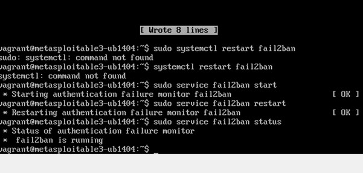

---

## Simulación de ataque con Hydra

Desde Kali Linux se realizó un ataque de fuerza bruta utilizando Hydra contra el servicio SSH del servidor Ubuntu.

```bash
hydra -l vagrant -P /usr/share/wordlists/rockyou.txt ssh://IP_Victima
```

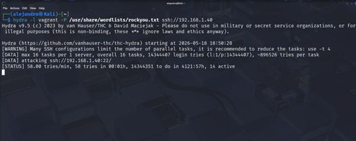

---

## Monitoreo de logs

Mientras se realizaba el ataque se monitorearon los registros de Fail2Ban utilizando:

```bash
sudo tail -f /var/log/fail2ban.log
```

Esto permitió observar los intentos fallidos y el bloqueo automático de la IP atacante.

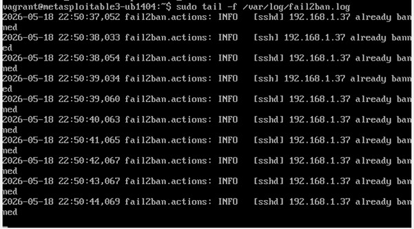

---

## Verificación de IP bloqueada

Posteriormente se comprobó que la dirección IP de la máquina atacante había sido bloqueada exitosamente.

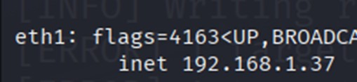

---

## Verificación de reglas firewall

Finalmente se verificaron las reglas del firewall utilizando iptables.

```bash
sudo iptables -L -n
```

Confirmando que la IP atacante fue bloqueada automáticamente.

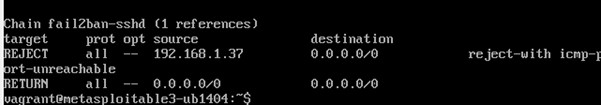

---

# Conclusión

Durante estos laboratorios se trabajó con herramientas orientadas a la defensa activa y protección de servicios críticos en entornos Linux.

En el primer laboratorio se identificaron vulnerabilidades mediante Nmap, investigando distintos CVE y aplicando medidas de mitigación mediante actualización y automatización de parches de seguridad.

En el segundo laboratorio se implementó Fail2Ban como sistema IDS/IPS para detectar y bloquear ataques de fuerza bruta contra SSH en tiempo real.

Además, las configuraciones implementadas contribuyen al cumplimiento de buenas prácticas de seguridad relacionadas con protección de datos, disponibilidad de servicios y administración segura de sistemas.

---

# Recomendaciones

- Mantener los sistemas y servicios constantemente actualizados.
- Aplicar parches de seguridad críticos lo antes posible.
- Implementar monitoreo continuo de logs y eventos de seguridad.
- Utilizar herramientas IDS/IPS para detectar ataques automáticamente.
- Restringir accesos innecesarios a servicios expuestos.
- Realizar auditorías y escaneos periódicos de vulnerabilidades.
- Implementar autenticación multifactor en servicios críticos.
